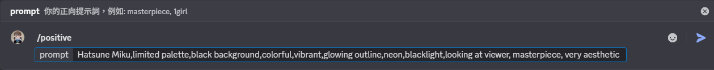
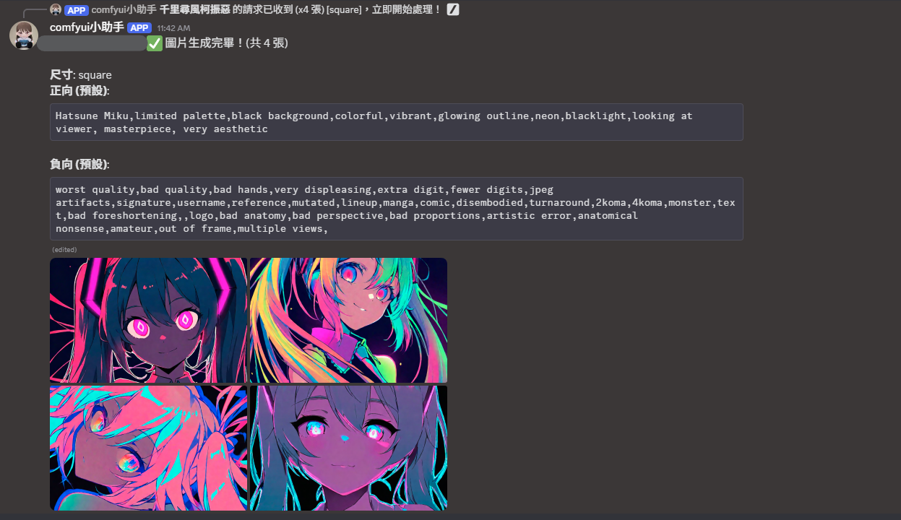
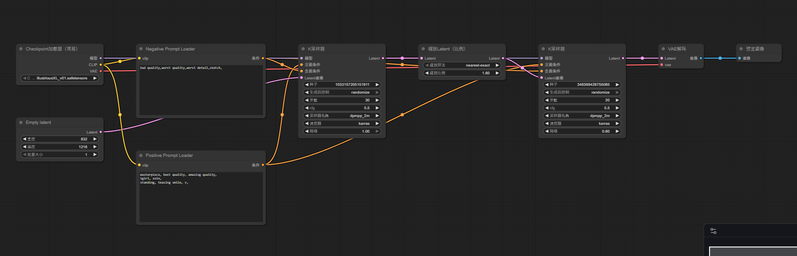

# ComfyUI - Discord小助手

一個簡單的Discord bot，讓用戶能在文字頻道中用指令控制ComfyUI。

有關ComfyUI的安裝與依賴請參閱[此處](https://github.com/comfyanonymous/ComfyUI)。

## 展示





## Bot Setup

詳細資訊請參閱[Discord Developer Portal: Intro | Documentation](https://discord.com/developers/docs/intro)，此處只簡單列舉設置bot的步驟。

### 1. 建立 Discord 應用程式
* 前往 Discord Developer Portal，點擊 "New Application"
* 輸入應用程式名稱，點擊 "Create"

### 2. 建立 Bot 使用者
* 在左側選單中，點擊 "Bot"，選擇 "Add Bot" 
    * 建議將public bot設為關閉

### 3. 設定 Bot 權限:
* 在"Privileged Gateway Intents"，找到並勾選:
    * MESSAGE CONTENT INTENT

###4. 取得 Bot Token:
* 在 Bot 設定頁面中，找到 "TOKEN" 區塊，點擊 "Reset Token" 按鈕
    * **! 不要隨意洩漏自己的TOKEN !!**

### 5. 邀請 Bot 到伺服器:
* 前往 OAuth2 設定頁面，點擊 "URL Generator"

* 在 "SCOPES" 區塊中，勾選以下選項：
    * bot（必須）
    * applications.commands（必須，用於 Slash Commands）
* 在 "BOT PERMISSIONS" 區塊中，勾選以下選項：
    * Send Messages（傳送訊息）
    * Attach Files（附加檔案）
    * Embed Links（嵌入連結）
    * Read Message History（讀取訊息歷史）

* 複製頁面底部自動生成的 "GENERATED URL"

## 安裝步驟

### 1. 克隆此專案
```bash
git clone <your-repo-url>
cd <your-repo-name>
```

### 2. 安裝依賴:
```bash
python -m pip install -r requirements.txt
```

### 3. 設定環境變數:
* 請參考[.env.example](.env.example)

### 4. 準備 ComfyUI workflow:
* 預設checkpoint使用[Illustrious-XL v0.1](https://civitai.com/models/795765?modelVersionId=889818)，請根據你的需求自行修改
* 將你的 workflow 儲存為 default_workflow.json
* 確保 workflow 中包含以下節點：
    * Positive Prompt Loader
    * Negative Prompt Loader
    * empty latent



### 5. 執行 Bot:
```bash
python bot.py
```

## Discord 指令

* `/gen [數量] [尺寸]` - 生成圖片
    * [尺寸]可選擇[直式]、[方形]、與[橫式]，默認為[直式]，832x1216
    * 可根據你的需求修改[bot.py](bot.py)中的IMAGE_SIZES

* `/positive <提示詞>` - 設定正向提示詞
* `/negative <提示詞>` - 設定負向提示詞
* `/checkpositive` - 查看目前的正向提示詞
* `/checknegative` - 查看目前的負向提示詞
* `/queue` - 查看佇列狀態
* `/cancel` - 取消你的請求
* `/help` - 顯示幫助訊息